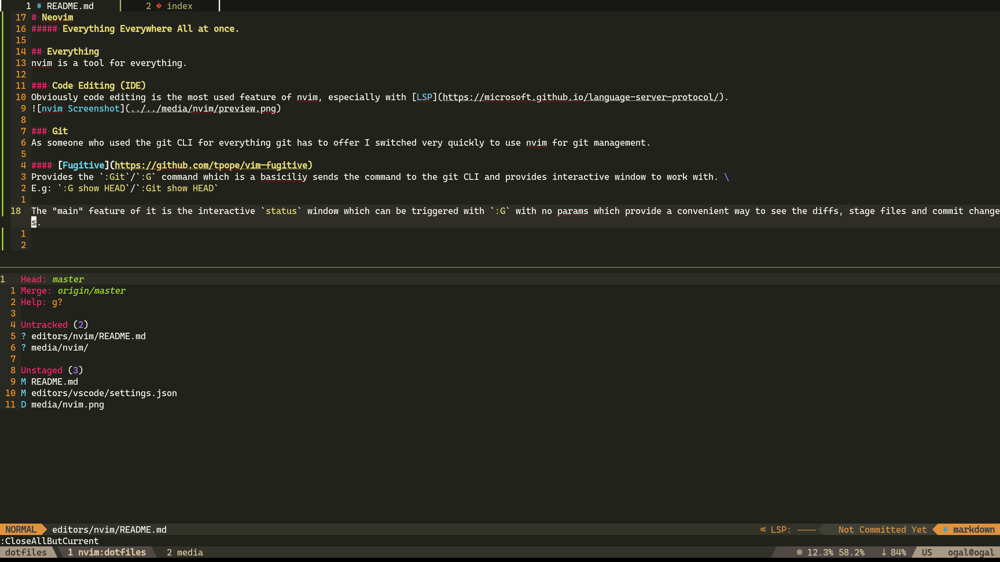
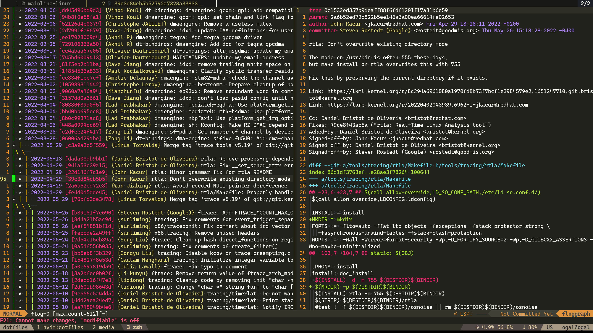
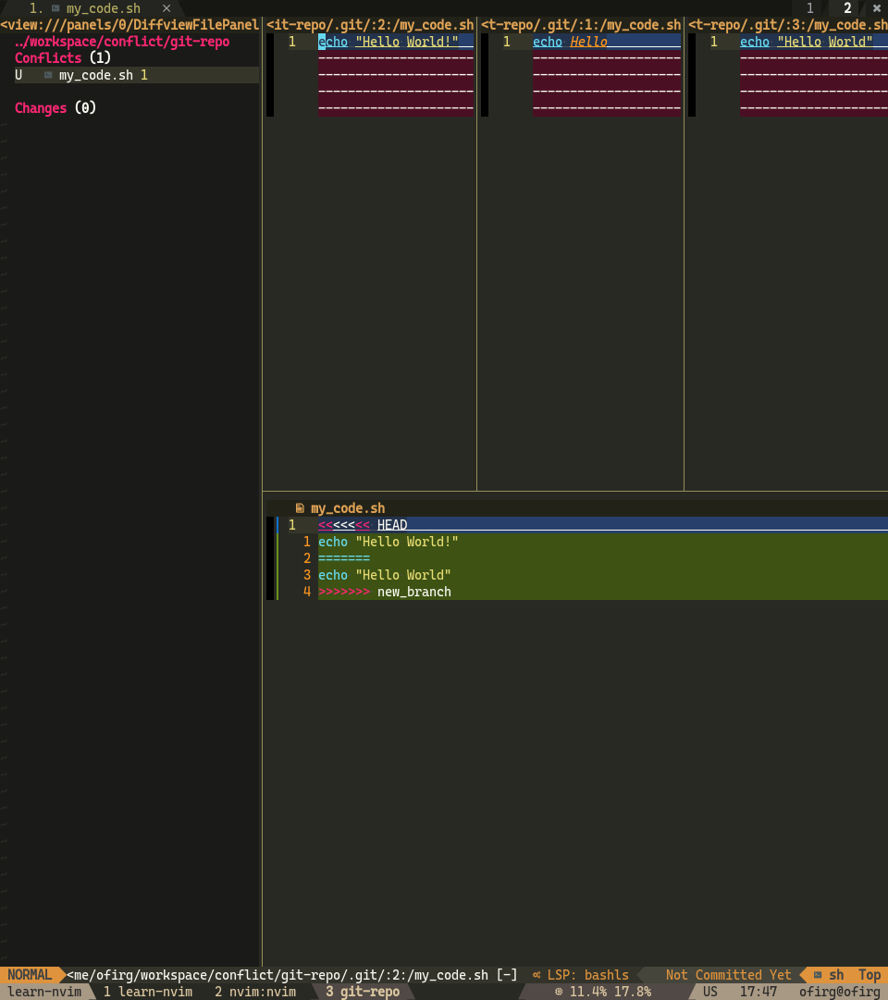

# Everything Everywhere All at once.

---

## Everything
nvim is a tool for everything.
My key bindings work as I like and use to in every tool I use daily.

### Code Editing (IDE)
Obviously code editing is the most used feature of nvim, especially with [LSP](https://microsoft.github.io/language-server-protocol/).

### Git
As someone who used the git CLI for everything git has to offer I switched very quickly to use nvim for git management.

#### [Fugitive](https://github.com/tpope/vim-fugitive)
Provides the `:Git`/`:G` command which is a basiciliy sends the command to the git CLI and provides interactive window to work with. \
E.g: `:G show HEAD`/`:Git show HEAD`

The "main" feature of it is the interactive `status` window which can be triggered with `:G` with no params which provide a convenient way to see the diffs, stage files and commit changes.

#### Git Tree (git log)
To see the git tree I use [vim-flog](https://github.com/rbong/vim-flog) which provides interactive git tree viewer. \
You can hit enter on a commit to see the diff, you can perform interactive rebase on the commit when hitting `ri` and much more. \
It so useful that I created `ngh` which is an alias to replace `git hist`, it opens a new nvim with a git tree.

#### Diffview
To see a big diff easily I use [diffview.nvim](https://github.com/sindrets/diffview.nvim).

I use it to see the history of a file too (`<leader>gh` in my `keymap.lua`).

#### Hunk History
How many times did you tried `git blame` to understand why this code exist only to see the last commit just `indent` the code or made a minor change. \
[git-messenger.vim](https://github.com/rhysd/git-messenger.vim) is comes to solve this by providing `hunk history`.

#### Conflict Solver
I use [diffconflicts](https://github.com/whiteinge/diffconflicts) to solve my git conflicts through nvim.

### Manpager
Nvim is my manpager too, and provides fast navigation, `man read` will open nvim, and it can be done with `:Man read` from inside nvim too. \
`gd` (go to definition, F12) is jumping to the man page under my cursor too!

### Interpreter
IPython is a great interpreter but why don't use it from inside nvim and send code lines straight from your code to it?

---

## Everywhere
I try to use nvim everywhere I can.

### [Firenvim](https://github.com/glacambre/firenvim)
Why don't you use nvim from inside your browser? \
Write emails with it. \
Write jira comments with it. \
Write github issues with it.

### Phone?
Well I don't use nvim from my phone but some people do. I should try it...

---

## All at Once
No idea, sorry :(
