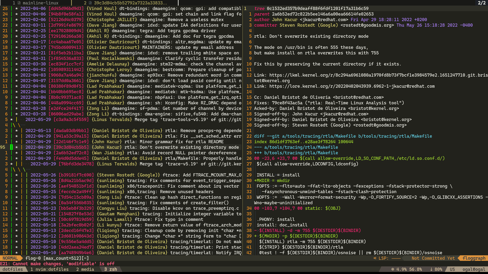
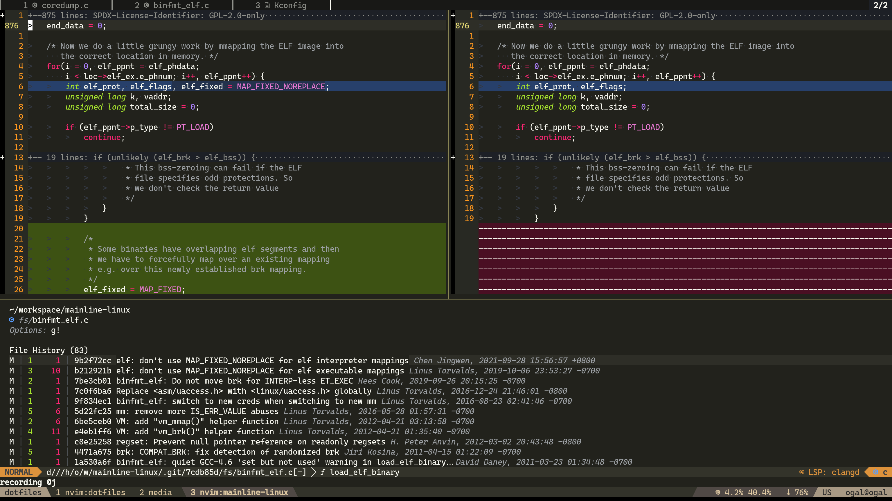

# Git
As someone who used the git CLI for everything git has to offer I switched very quickly to use nvim for git management. \
I'll cover some of the plugins I use to manage my git through nvim, I recommend to adapt some of them.

---

## [Fugitive](https://github.com/tpope/vim-fugitive)
Provides the `:Git`/`:G` command which basically sends the command to the git CLI and provides an interactive window to work with. \
E.g: `:G show HEAD`/`:Git show HEAD`

The "main" feature of it is the interactive `status` window which can be triggered with `:G` with no params which provide a convenient way to see the diffs, stage files and commit changes.

---

## [Gitsigns](https://github.com/lewis6991/gitsigns.nvim)
Shows the current diff in a column next to the line numbers, lets you to stage/revert/preview/blame hunk's.

---

## [Git blame](https://github.com/f-person/git-blame.nvim)
Shows the current line blame in the status bar or in virtual text.

---

## Git Tree (git log)
To see the git tree I use [vim-flog](https://github.com/rbong/vim-flog) which provides interactive git tree viewer. \
You can hit enter on a commit to see the diff, you can perform interactive rebase on the commit when hitting `ri` and much more. \
It so useful that I created `ngh` which is an alias to replace `git hist`, it opens a new nvim with a git tree.

---

## Diffview
To see a big diff easily I use [diffview.nvim](https://github.com/sindrets/diffview.nvim).

I use it to see the history of a file too (`<leader>gh` in my `keymap.lua`).

I use it to solve conflicts too.

---

## Hunk History
How many times did you tried `git blame` to understand why this code exist only to see the last commit just `indent` the code or made a minor change. \
[git-messenger.vim](https://github.com/rhysd/git-messenger.vim) is comes to solve this by providing `hunk history`.

